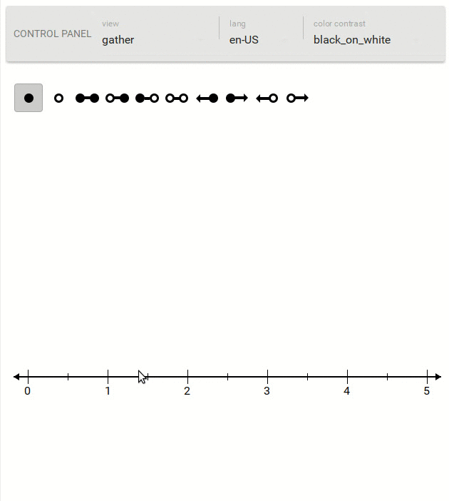

# corespring-number-line

[](https://travis-ci.org/PieElements/corespring-number-line)



A [pie](https://www.npmjs.com/package/pie) interaction that renders an interactive number line.

## Demo 

```shell
npm install -g pie
git clone git@github.com:PieElements/corespring-number-line.git
cd corespring-number-line/docs/demo
pie serve

```

### Test 

```shell 
npm test
```

#### port

This interaction is a port of a corespring internal component and due to this the data model is the same as that internal component's.

All properties work except for: 
* model.config.tickOverrides - wont support


