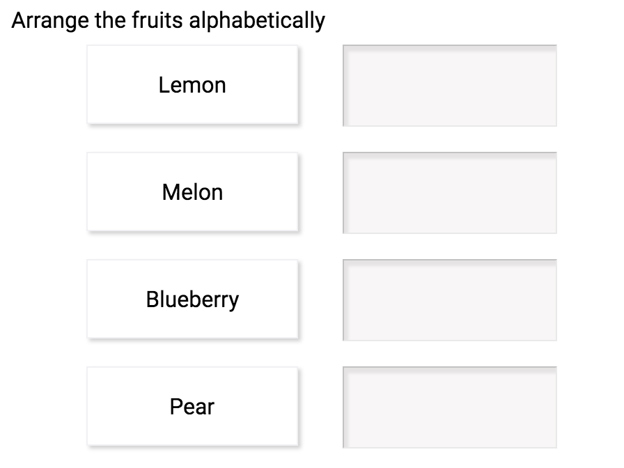

# placement-ordering

A [pie](http://github.com/PieLabs/pie) choice component.



## Usage 

To use this pie, you need to configure a `pie-question`. This means that you'll need to add it to the `index.html` and `config.json` files.

```html
<placement-ordering pie-id="1"></placement-ordering>
```

```javascript
{
  "id" : "1",
  "element" : "placement-ordering",
  "prompt" : "1 + 1 equals?",
  // more configuration...
}
```

### Pie Demo 
There is a demo in `docs/demo` that you can run to see an example of it's usage.

To preview it in that context you'll need the [pie](/PieLabs/pie-cli) tool.

```shell
npm install -g pie 
cd corespring-placement-ordering/docs/demo
pie serve #will build and serve the pie... then go to http://localhost:4000
```

## Test 

```shell 
npm test # run client and controller tests
npm run client-test # run client tests
npm run controller-test # run controller tests
```

## Release 

```shell
gulp release
git checkout master
npm publish
```
